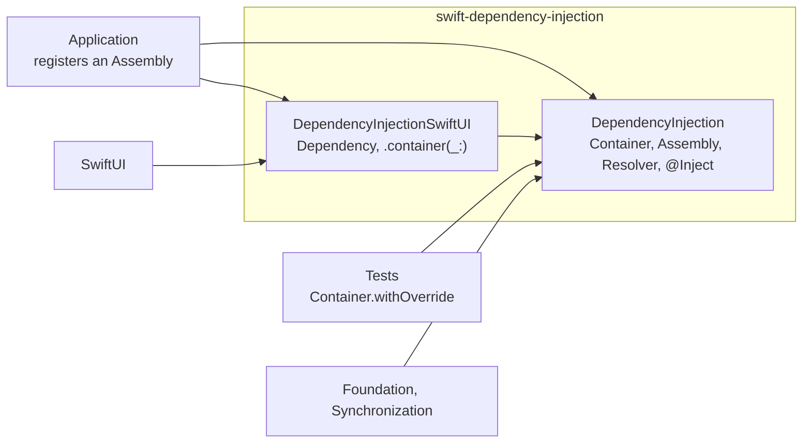
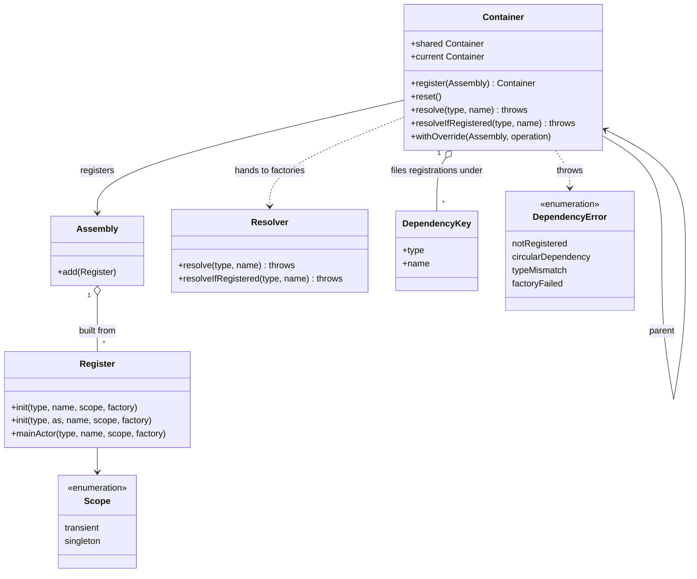
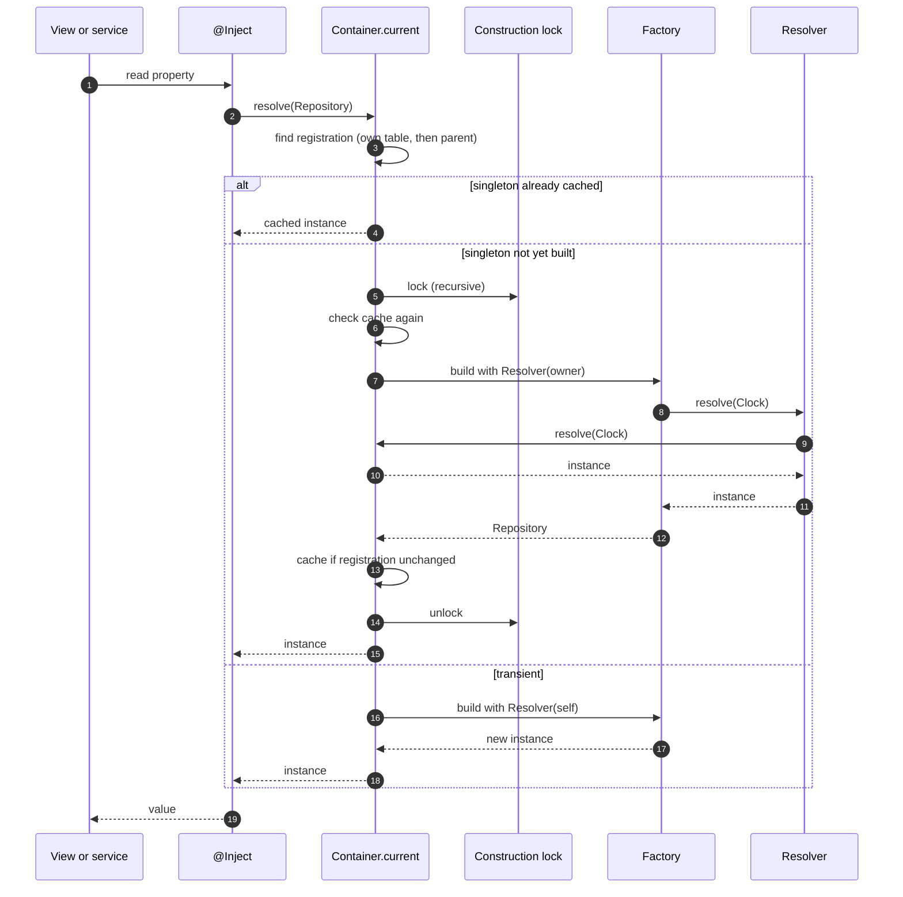
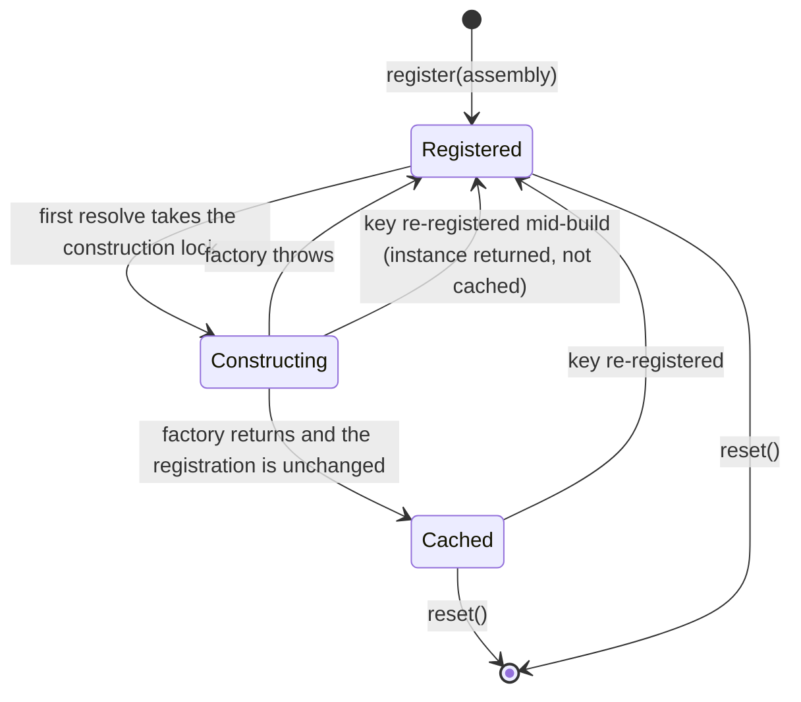
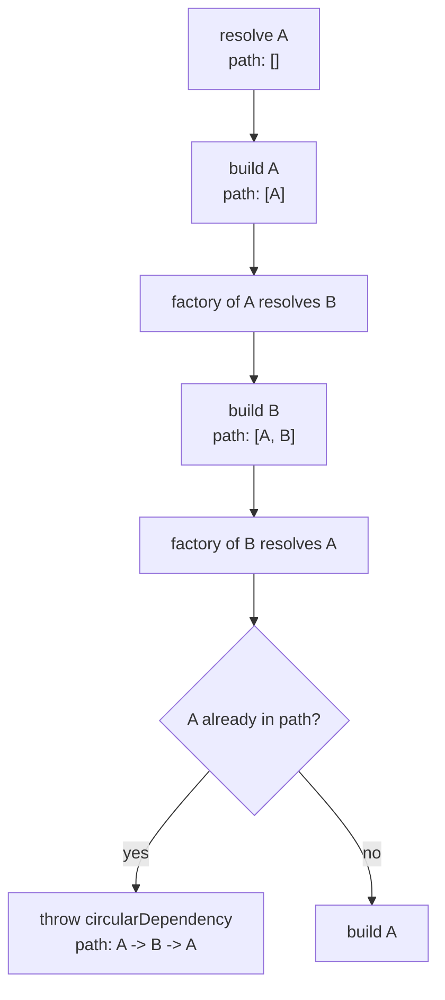

# Dependency Injection

[](Package.swift)
[](Package.swift)
[](Package.swift)
[](#installation)
[](Package.swift)
[](scripts/mutation-check.sh)
[](LICENSE)

**A small, `Sendable` dependency injection container for Swift 6, with an `@Inject` property wrapper, singleton and transient scopes, task-scoped test overrides and a SwiftUI environment integration.**

An application declares its registrations once, as an `Assembly`. Views, services and tests then read dependencies through `@Inject` or `Container.resolve`. The container:

1. Builds each dependency from a factory that may itself resolve other dependencies.
2. Keeps one instance per singleton registration and a fresh instance per transient one.
3. Reports a missing registration, a circular dependency or a failing factory as a typed error that names the key involved.
4. Lets a test replace registrations for the duration of one task without touching any other test.

The code is built so that:

- **There is no global mutable state.** `Container.shared` is an immutable reference to a container whose contents are guarded by a `Mutex`. The package compiles in the Swift 6 language mode with warnings treated as errors.
- **A singleton is built exactly once**, even when a thousand tasks ask for it at the same moment.
- **A cycle is an error with a path**, not a stack overflow and not a deadlock.
- **Test overrides cannot leak.** They are bound to a task tree, and a singleton never captures a dependency that was overridden for a test.
- **The tests are tested.** Every behavioural guarantee has a named mutant in `scripts/mutation-check.sh` that must make the matching test fail.

Design rationale is recorded in [`docs/adr`](docs/adr) and summarised in [Design decisions](#design-decisions).

---

## Contents

- [At a glance](#at-a-glance)
- [Installation](#installation)
- [Quick start](#quick-start)
- [Walkthrough](#walkthrough)
- [Architecture](#architecture)
- [Resolution](#resolution)
- [Singleton lifecycle](#singleton-lifecycle)
- [Cycle detection](#cycle-detection)
- [Concurrency model](#concurrency-model)
- [Errors](#errors)
- [Testing](#testing)
- [Migrating from 1.x](#migrating-from-1x)
- [Design decisions](#design-decisions)
- [Limitations](#limitations)
- [Repository layout](#repository-layout)
- [License](#license)

## At a glance

| Concern | Type | Role |
| --- | --- | --- |
| Holding and resolving | `Container` | Registration table, singleton cache, resolution entry point |
| Declaring | `Assembly`, `Register` | A value describing registrations; built with a result builder |
| Building | `Resolver` | Handed to factories so they can resolve their own dependencies |
| Identifying | `DependencyKey` | Type identity plus optional binding name |
| Reading | `@Inject`, `@InjectIfRegistered` | Property wrappers that resolve from `Container.current` on every read |
| Reading in views | `Dependency` | Property wrapper that resolves from the SwiftUI environment |
| Lifetime | `Scope` | `.transient` or `.singleton` |
| Failing | `DependencyError` | `notRegistered`, `circularDependency`, `typeMismatch`, `factoryFailed` |
| Testing | `Container.withOverride` | Binds a child container for the duration of an operation |

| Library product | Imports | Contents |
| --- | --- | --- |
| `DependencyInjection` | Foundation, Synchronization | Everything above except the SwiftUI pieces |
| `DependencyInjectionSwiftUI` | SwiftUI | `Dependency`, `EnvironmentValues.container`, `View.container(_:)` |

## Installation

```swift
// Package.swift
dependencies: [
    .package(url: "https://github.com/denismurphy/swift-dependency-injection", from: "2.0.0"),
],
targets: [
    .target(
        name: "App",
        dependencies: [
            .product(name: "DependencyInjection", package: "swift-dependency-injection"),
            .product(name: "DependencyInjectionSwiftUI", package: "swift-dependency-injection"),
        ]
    ),
]
```

Requirements: Swift 6.2 toolchain, iOS 26 or macOS 26.

## Quick start

```swift
import DependencyInjection

protocol Clock: Sendable {
    func now() -> Date
}

struct SystemClock: Clock {
    func now() -> Date { .now }
}

final class Repository: Sendable {
    let clock: any Clock
    init(clock: any Clock) { self.clock = clock }
}

let assembly = Assembly {
    Register(SystemClock.self, as: (any Clock).self, scope: .singleton) { _ in
        SystemClock()
    }
    Register(Repository.self) { resolver in
        Repository(clock: try resolver.resolve((any Clock).self))
    }
}

Container.shared.register(assembly)

struct ReportService {
    @Inject var repository: Repository
}
```

`Register(_:as:)` makes `SystemClock` resolvable under both its own type and `any Clock`. For a singleton the two keys return the same instance.

## Walkthrough

### Registering

`Register` takes the type, an optional binding name, a scope and a factory.

```swift
let assembly = Assembly {
    Register(Settings.self, scope: .singleton) { _ in Settings() }
    Register(Service.self, name: "primary") { _ in Service(id: 1) }
    Register(Service.self, name: "fallback") { _ in Service(id: 2) }

    if ProcessInfo.processInfo.arguments.contains("-uiTesting") {
        Register((any Clock).self) { _ in FixedClock() }
    }
}
```

An `Assembly` is a value. Combine two with `+`, or append with `add(_:)`. Later registrations for the same key replace earlier ones. Registering a key that is already in a container replaces it and discards any singleton cached for it.

### Resolving where failure is recoverable

```swift
do {
    let repository = try Container.shared.resolve(Repository.self)
    let fallback = try Container.shared.resolve(Service.self, name: "fallback")
} catch {
    // error is a DependencyError; its description names the key and how to fix it
    print(error)
}

let optionalService = try Container.shared.resolveIfRegistered(Service.self)
```

`resolveIfRegistered` returns `nil` only when the requested key has no registration. A failure inside one of its dependencies is still thrown.

### Resolving where failure is a bug

```swift
struct Checkout {
    @Inject var repository: Repository
    @Inject(name: "primary") var service: Service
    @InjectIfRegistered var analytics: Analytics?
}
```

A property wrapper cannot throw. `@Inject` therefore stops the process with the `DependencyError` description when a registration is missing. Every read resolves again, so a transient registration produces a new instance per read; assign to a local when one instance is needed across several statements.

### SwiftUI

```swift
import DependencyInjection
import DependencyInjectionSwiftUI
import SwiftUI

struct HomeView: View {
    @Dependency var repository: Repository

    var body: some View {
        Text("Clock: \(repository.clock.now().formatted())")
    }
}

struct RootView: View {
    var body: some View {
        HomeView().container(.shared)
    }
}
```

`@Inject` reads a task-local binding, which a view body is never inside. `Dependency` reads the container from the SwiftUI environment instead, so `.container(_:)` governs a whole subtree.

### Main-actor registrations

```swift
@MainActor
final class HomeModel: Sendable { /* ... */ }

let assembly = Assembly {
    Register.mainActor(HomeModel.self, scope: .singleton) { _ in HomeModel() }
}
```

A main-actor type cannot be constructed from an arbitrary `@Sendable` factory. `Register.mainActor` accepts a main-actor factory and asserts main-thread isolation when it runs, so resolve such registrations on the main thread.

### Overriding in tests

```swift
import Testing
import DependencyInjection

@Test func reportsTheFixedTime() throws {
    let overrides = Assembly {
        Register((any Clock).self) { _ in FixedClock() }
    }

    try Container.withOverride(overrides) {
        let repository = try Container.current.resolve(Repository.self)
        #expect(repository.clock.now() == FixedClock.instant)
    }
}
```

Registrations in the override shadow those of the container that was current; everything else falls through to it. The override ends when the closure returns, and parallel tests each get their own. An `async` overload takes an `async` closure.

## Architecture



The core target does not import SwiftUI. It uses `Synchronization.Mutex` for state and `NSRecursiveLock` for singleton construction.



A container has an optional parent. Lookups that miss fall through to it, which is how scoped overrides work.

## Resolution



Two rules decide which container a factory resolves against:

- A **transient** registration resolves its dependencies against the container that was asked. An override of a dependency is therefore visible to a transient registered in a parent.
- A **singleton** resolves its dependencies against the container that owns it. An instance that outlives a test scope can never hold a test double.

## Singleton lifecycle



- **Lazy:** nothing is built until the first resolution.
- **Failure leaves no residue.** A factory that throws leaves the key registered and uncached, so the next resolution tries again.
- **Replacement wins.** Re-registering a key discards its cached instance. An instance that was mid-construction when that happened is returned to its caller but is not stored.

## Cycle detection



The keys under construction are kept in a task-local array. Every factory call goes through one function that checks it, so the check also catches a cycle closed by an `@Inject` or `Container.current.resolve` call inside the constructed object's initialiser.

## Concurrency model

| Concern | Mechanism |
| --- | --- |
| Registration table and singleton cache | `Mutex<State>`, held only for dictionary reads and writes |
| Singleton construction | One `NSRecursiveLock` per container, with a second cache check after acquiring it |
| Transient construction | No lock; the factory runs on the caller's thread |
| Which container `@Inject` reads | `@TaskLocal Container.current`, defaulting to `Container.shared` |
| Cycle path | `@TaskLocal` array of keys under construction |
| Resolved values | Must be `Sendable` |

Consequences worth knowing:

- Resolution is synchronous and can be called from any isolation domain.
- Singleton construction is serial within a container. Keep singleton factories cheap and do not block them on work that needs another thread to resolve a singleton from the same container.
- Task-locals follow structured concurrency. Child tasks and task groups inherit `Container.current`; `Task.detached` does not.

## Errors

| Case | Raised when | Message names |
| --- | --- | --- |
| `notRegistered(key)` | No registration for the type and name, in this container or any parent | The key and how to register it |
| `circularDependency(path:)` | A key is reached again while it is being built | The full path, outermost first |
| `typeMismatch(key:actual:)` | The registered value is not the requested type, such as an alias for a protocol the type does not adopt | The key and the actual type |
| `factoryFailed(key, underlying:)` | A factory threw something other than a `DependencyError` | The key and the underlying error |

A `DependencyError` raised by a nested resolution passes through unchanged, so a missing transitive dependency is reported against the key that is missing, not against the registration that needed it.

## Testing

```bash
swift test
scripts/mutation-check.sh
```

The suite uses Swift Testing and covers scopes, named bindings, protocol aliases, re-registration, every error case, nested and cyclic resolution, one thousand concurrent first resolutions of a singleton, scoped overrides running concurrently, both property wrappers, main-actor registrations and the SwiftUI environment (rendered through `ImageRenderer`).

`scripts/mutation-check.sh` copies the package to a scratch directory and disables one behaviour at a time: the singleton cache write, the second cache check, the construction lock, the cycle check, cache eviction on re-registration, the child-container fall-through, the environment binding, and others. Each mutant names the test that must fail because of it. A mutant that survives, does not apply or does not compile fails the script. The working tree is never modified.

The container tests were written against a stub and seen failing before the implementation existed, then passing, then failing again under their mutant. The SwiftUI tests and the test for re-registration during construction were added afterwards and are proven by their mutants alone.

## Migrating from 1.x

2.0 is a redesign and is source-incompatible.

| 1.x | 2.0 |
| --- | --- |
| `Context.instance` | `Container.shared` |
| `AssemblyBuilder.instance.add(...).build()` | `Assembly { Register(...) }` |
| `Context.instance.register(assembly)` | `Container.shared.register(assembly)` |
| `Scope.prototype` | `Scope.transient` |
| `Initialisable`, `Injectable`, `add(Type.self)` | A factory closure: `Register(Type.self) { _ in Type() }` |
| `add(factory:protocol:...)` | `Register(Type.self, as: (any Proto).self) { ... }` |
| `resolve(name:)` returning a value or trapping | `resolve(_:name:)` throwing `DependencyError` |
| `@Inject var x: Foo?` resolving `Foo` | `@InjectIfRegistered var x: Foo?` |
| `resolveStateObject`, `resolveObservedObject` | Removed. Use `@Observable` models and resolve them with `@Dependency` |
| `weakResolve`, `WeakObjectWrapper` | Removed. Instance lifetime belongs to the container |
| `DependencyInjection` typealias, `TypeHelper`, `isClass`, `Optional.some`, `Optional.nil` | Removed |
| Swift 5 language mode, iOS 13 and macOS 11 | Swift 6 language mode, iOS 26 and macOS 26 |

## Design decisions

- **A mutex, not an actor.** A property wrapper getter is synchronous, so the container must be too. See [ADR 0001](docs/adr/0001-lock-not-actor.md).
- **Keys are type identity, not names.** `ObjectIdentifier` plus a binding name allocates nothing and cannot collide across modules. See [ADR 0002](docs/adr/0002-objectidentifier-keys.md).
- **`@Inject` stores a key, not an instance.** Caching in the wrapper either extends transient lifetimes or fails to hold them at all. See [ADR 0003](docs/adr/0003-no-weak-caching.md).
- **Overrides are scoped to a task tree.** A child container bound through a task-local keeps parallel tests apart and cannot leak into a singleton. See [ADR 0004](docs/adr/0004-task-local-overrides.md).
- **Singleton construction is serialised, cycles are found by path.** One recursive lock per container removes the two-thread half-cycle deadlock; a task-local path reports the cycle. See [ADR 0005](docs/adr/0005-singleton-construction-and-cycle-detection.md).
- **Typed errors from the container, a trap from `@Inject`.** See [ADR 0006](docs/adr/0006-typed-errors-and-inject-precondition.md).

## Limitations

- **Platforms:** iOS 26 and macOS 26 only. `Synchronization.Mutex` and the language features used require recent toolchains and deployment targets.
- **`@Inject` traps** on a missing registration. Use `Container.resolve` where the failure must be handled.
- **Resolved values must be `Sendable`.** Main-actor classes qualify, but must be registered with `Register.mainActor` and resolved on the main thread.
- **`Task.detached` does not inherit overrides.** Code running there sees `Container.shared`.
- **Singleton construction is serial per container.** See the [concurrency model](#concurrency-model).
- **No lifetime beyond transient and singleton.** There are no per-request or per-scope lifetimes; use a child container.
- **No compile-time graph validation.** Missing registrations surface at resolution, not at build time.

## Repository layout

```
Package.swift                                Tools 6.2, Swift 6 language mode, iOS 26 and macOS 26
Sources/
  DependencyInjection/
    Container.swift                          Registration table, resolution, singleton construction, cycle check
    Container+Scoping.swift                  Container.current and withOverride
    Assembly.swift                           Register, the result builder and Assembly
    Registration.swift                       Internal registration record and factory wrapping
    Resolver.swift                           What factories receive
    DependencyKey.swift                      Type identity plus binding name
    DependencyError.swift                    Typed errors
    Inject.swift                             @Inject and @InjectIfRegistered
    Scope.swift                              transient and singleton
  DependencyInjectionSwiftUI/
    Container+Environment.swift              Environment value, .container(_:), Dependency
Tests/
  DependencyInjectionTests/                  Swift Testing suites and fixtures
docs/
  adr/                                       Numbered architecture decision records
scripts/
  mutation-check.sh                          Targeted mutation checks
```

## License

[MIT](LICENSE)
